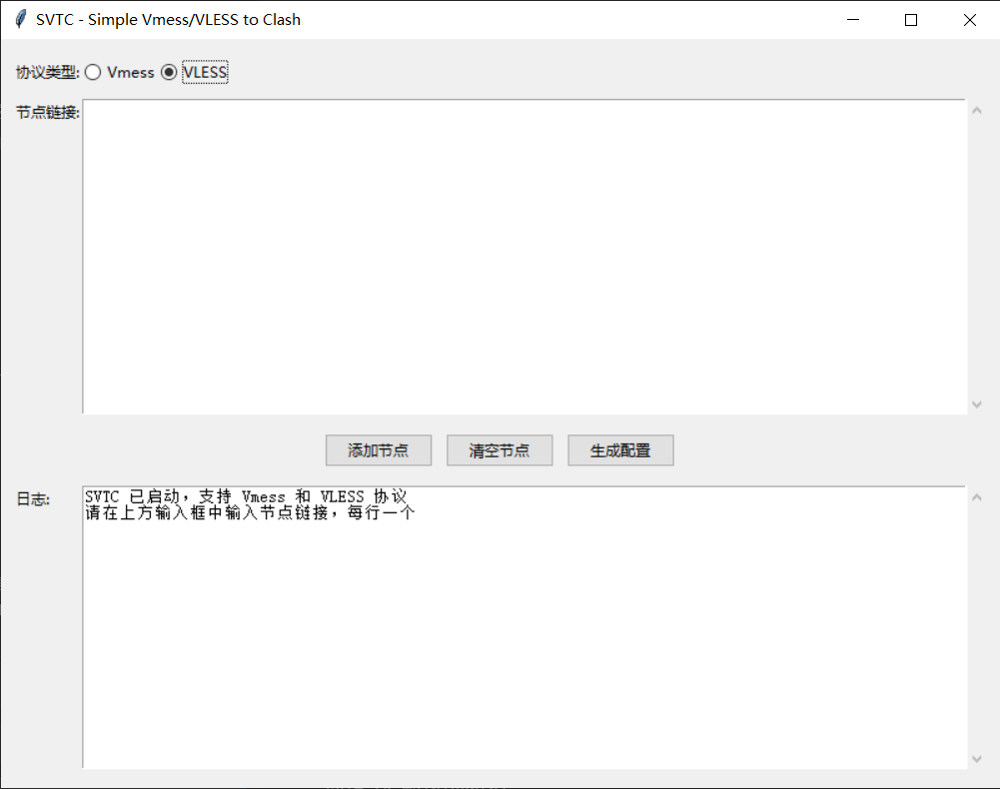

# SVTC - Simple Vmess/VLESS to Clash
改自shiinakaze/SingleVmessToClash
界面如下


一个简单易用的工具，用于将 Vmess 和 VLESS 节点链接转换为 Clash 配置文件。

## 功能特点

- 支持 Vmess 和 VLESS 协议节点链接解析
- 提供图形用户界面（GUI）和命令行两种使用方式
- 批量处理多个节点链接
- 自动生成 Clash 配置文件
- 支持 WebSocket 和 TLS 配置
- 自动更新代理组配置

## 安装依赖

在使用之前，请确保安装了必要的 Python 包：

```bash
pip install pyyaml
```

## 使用方法

### 图形界面模式

直接运行程序启动图形界面：

```bash
python Simple VmessVLESS to Clash.py
```

在图形界面中：
1. 选择协议类型（Vmess 或 VLESS）
2. 在文本框中粘贴节点链接（每行一个）
3. 点击"添加节点"按钮
4. 点击"生成配置"按钮创建 Clash 配置文件

## 支持的协议

### Vmess
- 支持 Base64 编码的 JSON 格式链接
- 支持 WebSocket 网络传输
- 支持 TLS 安全连接

### VLESS
- 支持 URI 格式链接
- 支持多种参数配置（path, host, security, sni, fp, alpn 等）
- 支持 WebSocket 网络传输和 TLS 安全连接

## 配置模板

程序会使用当前目录下的 `template.yaml` 文件作为配置模板。如果该文件不存在，程序会自动创建一个基础配置。

模板文件包含：
- 基础的 Clash 配置设置
- 代理组定义
- 规则配置

## 输出文件

生成的 Clash 配置文件将保存为 `SVTC.yaml`。

## 界面说明

### 主界面元素
- **协议类型选择**：选择要处理的协议类型（Vmess 或 VLESS）
- **节点链接输入框**：粘贴节点链接，支持批量输入（每行一个）
- **添加节点按钮**：解析并添加输入框中的节点链接
- **清空节点按钮**：清空已添加的节点列表
- **生成配置按钮**：生成最终的 Clash 配置文件
- **日志显示区域**：显示操作日志和错误信息

## 注意事项

1. 确保输入的节点链接格式正确
2. 生成的新配置会覆盖之前的 `SVTC.yaml` 文件

## 常见问题

### 如何批量处理节点？
在节点链接输入框中，每行粘贴一个节点链接，然后点击"添加节点"按钮。

### 生成的配置文件在哪里？
生成的配置文件默认保存为程序目录下的 `SVTC.yaml`。

- 支持 Vmess 和 VLESS 协议
- 提供 GUI 和命令行两种使用方式
- 支持批量处理节点链接
